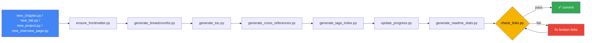

<div align="center">

# 📚 Principal Data & AI Engineer Handbook

**A long-term, continuously growing engineering handbook** — Data Engineering, AI Engineering, distributed systems, platform/infra, and career growth toward a Principal-level role.

[](https://github.com/Alw1tz/principal-data-ai-engineer-handbook/actions/workflows/ci.yml)
[](LICENSE)
[](scripts/README.md)
[](CONTRIBUTING.md#style)
[](CONTRIBUTING.md)

<!-- STATS:START -->
**29** topics · **38** pages · **0/38** complete (0%) · **8** lab categories · **9** projects · **0** prompts · **38** tags
<!-- STATS:END -->

</div>

---

Structured like production documentation (Stripe/AWS/Google-style): every topic follows the same template, so once you know the shape of one chapter you know all of them. This is not a notes dump — every chapter in `topics/` is meant to eventually answer, for its subject: how it works internally, how it's run in production, what breaks, what a senior engineer knows that a mid-level one doesn't, and what a principal engineer knows that a senior one doesn't.

## How it's organized

| | Directory | What's in it |
|---|---|---|
| 📚 | [`topics/`](topics/README.md) | One directory per subject (Spark, AWS, LLMs, System Design, Leadership, ...). Every chapter follows [`templates/chapter-template.md`](templates/chapter-template.md) — identical sections everywhere. |
| 🏗️ | [`projects/`](projects/README.md) | Design-doc placeholders for larger production-style builds. A project that gets built for real gets its own repo, linked back from its page here. |
| 💬 | [`prompts/`](prompts/README.md) | Reusable prompts — Claude, ChatGPT, interview prep, architecture, coding, system design. |
| 🧪 | [`labs/`](labs/README.md) | Standalone, runnable hands-on exercises, grouped by tool. |
| 🧩 | [`templates/`](templates/README.md) | The canonical page shapes everything above is generated from. |
| ⚙️ | [`scripts/`](scripts/README.md) | Automation — scaffolding, table of contents, breadcrumbs, cross-references, tags, progress tracking, link validation. |
| 🖼️ | [`assets/`](assets/README.md) | Images, diagrams, architecture exports, mermaid sources, PDFs. |
| 🔧 | [`.github/`](.github/workflows/ci.yml) | CI (validates every push), issue/PR templates. |

## Root documents

- [ROADMAP.md](ROADMAP.md) — phased plan of what gets written, in what order
- [STUDY_PLAN.md](STUDY_PLAN.md) — weekly cadence + session log
- [PROGRESS.md](PROGRESS.md) — per-topic completion tracker (auto-computed)
- [BOOKS.md](BOOKS.md) — reading list
- [PAPERS.md](PAPERS.md) — research papers queue
- [RESOURCES.md](RESOURCES.md) — curated external links
- [PROJECTS.md](PROJECTS.md) — status tracker for everything in `projects/`
- [INTERVIEW_TRACKER.md](INTERVIEW_TRACKER.md) — interview prep tracker (incl. Salesforce)
- [TAGS.md](TAGS.md) — every tag in use, with links to every page carrying it
- [CHANGELOG.md](CHANGELOG.md) — notable structural/tooling changes
- [CONTRIBUTING.md](CONTRIBUTING.md) — conventions for adding new content
- [LICENSE](LICENSE) — MIT

## How the documentation system works

Every content page (chapter, lab, project, interview question) carries three HTML-comment metadata lines (`tags`, `status`, `updated`) — invisible when rendered on GitHub, machine-readable by every script in `scripts/`. That one mechanism drives everything else:



`python3 scripts/build.py` runs that whole pipeline in one command — it's the only thing you need to remember, and it's also exactly what [CI](.github/workflows/ci.yml) runs on every push, failing the build if generated content wasn't committed.

- **Tags & cross-references** — pages sharing a tag auto-link each other in a "Related" section, ranked by shared-tag count. New pages are auto-tagged with their parent topic/lab slug.
- **Breadcrumbs** — `Home / Topics / Spark / Shuffle Internals`, computed from the page's actual location.
- **Chapter completion / reading progress** — `status` is `not-started` / `in-progress` / `complete`. Every listing shows ⬜/🟡/✅ inline; [PROGRESS.md](PROGRESS.md) rolls it up per topic.
- **Automatic tables of contents** — every index page lists its actual current contents, rebuilt from disk, never hand-edited.

## Adding content

```bash
# new chapter under an existing topic (auto-tagged with the topic slug)
python3 scripts/new_chapter.py spark shuffle-internals --title "Shuffle Internals"

# new hands-on lab / interview question / project
python3 scripts/new_lab.py snowflake time-travel-recovery --title "Time Travel Recovery"
python3 scripts/new_interview_page.py design-a-rate-limiter --title "Design a Rate Limiter"
python3 scripts/new_project.py real-time-feature-store --title "Real-Time Feature Store"

# ... fill in the sections, then:
python3 scripts/mark_complete.py topics/spark/02-shuffle-internals.md
python3 scripts/log_study.py spark 2.5 --notes "Read chapter 1, did the AWS lab"

# after touching any page — the one command that regenerates and validates everything:
python3 scripts/build.py
```

All scripts are stdlib-only Python — no venv or dependencies needed. Full reference: [scripts/README.md](scripts/README.md).

## Browse everything

<details>
<summary><strong>Full table of contents</strong> — 4 sections, expand to browse</summary>

<!-- TOC:START -->
- **[Topics](topics/README.md)**
  - [AI Engineering](topics/ai-engineering/README.md)
  - [Airflow](topics/airflow/README.md)
  - [AWS](topics/aws/README.md)
  - [Data Governance](topics/data-governance/README.md)
  - [Data Modeling](topics/data-modeling/README.md)
  - [dbt](topics/dbt/README.md)
  - [Distributed Systems](topics/distributed-systems/README.md)
  - [Kafka](topics/kafka/README.md)
  - [Knowledge Graphs](topics/knowledge-graphs/README.md)
  - [Kubernetes](topics/kubernetes/README.md)
  - [Lakehouse](topics/lakehouse/README.md)
  - [LangGraph](topics/langgraph/README.md)
  - [Leadership](topics/leadership/README.md)
  - [LLMs](topics/llms/README.md)
  - [MCP](topics/mcp/README.md)
  - [Mock Interviews](topics/mock-interviews/README.md)
  - [Observability](topics/observability/README.md)
  - [Production Projects](topics/production-projects/README.md)
  - [Python](topics/python/README.md)
  - [RAG](topics/rag/README.md)
  - [Research Papers](topics/research-papers/README.md)
  - [Salesforce Interview Preparation](topics/salesforce-interview-preparation/README.md)
  - [Security](topics/security/README.md)
  - [Snowflake](topics/snowflake/README.md)
  - [Spark](topics/spark/README.md)
  - [SQL](topics/sql/README.md)
  - [System Design](topics/system-design/README.md)
  - [Terraform](topics/terraform/README.md)
  - [Vector Databases](topics/vector-databases/README.md)
- **[Projects](projects/README.md)**
  - [Agentic Data Platform](projects/agentic-data-platform/README.md)
  - [AI SQL Assistant](projects/ai-sql-assistant/README.md)
  - [Data Catalog](projects/data-catalog/README.md)
  - [Data Lineage Platform](projects/data-lineage-platform/README.md)
  - [Data Quality Platform](projects/data-quality-platform/README.md)
  - [Knowledge Graph](projects/knowledge-graph/README.md)
  - [MCP Server](projects/mcp-server/README.md)
  - [Metadata Platform](projects/metadata-platform/README.md)
  - [Streaming Platform](projects/streaming-platform/README.md)
- **[Prompts](prompts/README.md)**
  - [Architecture Prompts](prompts/architecture-prompts/README.md)
  - [ChatGPT Prompts](prompts/chatgpt-prompts/README.md)
  - [Claude Prompts](prompts/claude-prompts/README.md)
  - [Coding Prompts](prompts/coding-prompts/README.md)
  - [Interview Prompts](prompts/interview-prompts/README.md)
  - [System Design Prompts](prompts/system-design-prompts/README.md)
- **[Labs](labs/README.md)**
  - [AI Labs](labs/ai/README.md)
  - [Airflow Labs](labs/airflow/README.md)
  - [AWS Labs](labs/aws/README.md)
  - [dbt Labs](labs/dbt/README.md)
  - [Kafka Labs](labs/kafka/README.md)
  - [Python Labs](labs/python/README.md)
  - [Snowflake Labs](labs/snowflake/README.md)
  - [Spark Labs](labs/spark/README.md)
<!-- TOC:END -->

</details>
